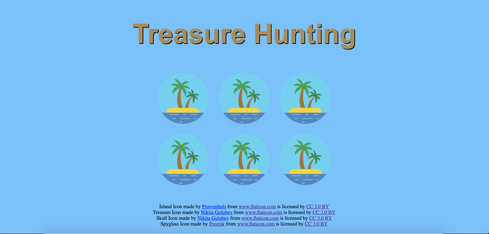

# TreasureHunting
Side-Project of the FrontEnd-Developer Program from OpenCampusSH

The goal was to build a website with objects that hide something. When hovering or clicking the item there should be a reaction. I chose a Treasure Hunting theme and hid the treasure in the middle of some skulls. Try hovering or clicking the boxes to see what will happen.

Screenshot:

